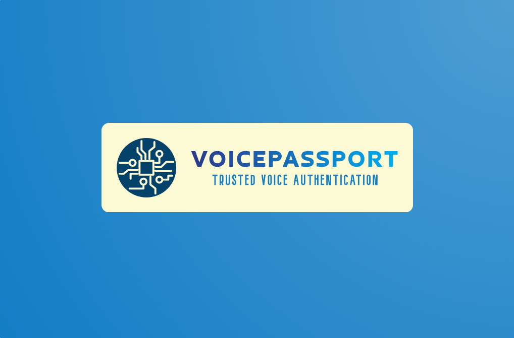
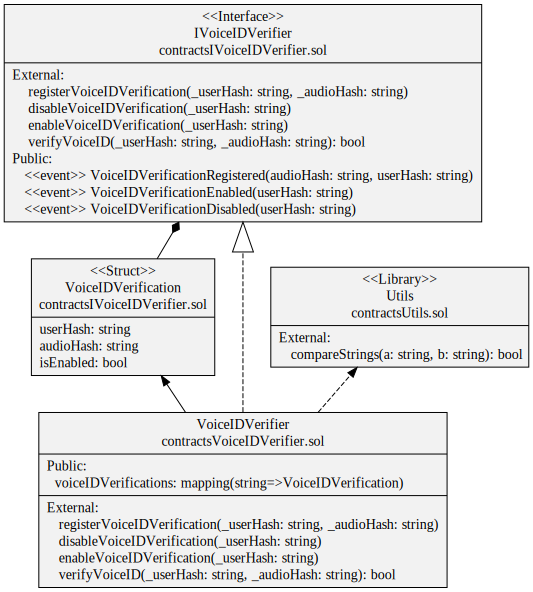

# VoicePassport: Your Trusted Voice Authentication Companion 🎙️🔒

🔒🗣️ VoicePassport is a robust and secure voice authentication system designed to ensure the authenticity of users through their unique voiceprints. Powered by Resemblyzer, VoicePassport leverages advanced voice processing technology to generate voice embeddings, which are compact numerical representations of voice characteristics. These embeddings capture the distinctive features of an individual's voice in a highly accurate and secure manner.

🔍🔐 Using these voice embeddings, VoicePassport employs a similarity search mechanism to authenticate users. By comparing the voice embeddings extracted from an input voice sample with those stored in its database, VoicePassport can determine the likelihood of a match, thereby verifying the identity of the user.

💼💬 VoicePassport offers a reliable and efficient means of authentication, enabling seamless user access to various applications and services while ensuring a high level of security. With its innovative approach to voice-based authentication, VoicePassport provides a convenient and dependable solution for organizations seeking robust identity verification mechanisms.

  
  
  
  
  
  
  
  
  
  
  
  
  
  
  

## ✨ Features

* **🔒 Advanced Voice Authentication**: VoicePassport harnesses the cutting-edge Resemblyzer technology to analyze and generate unique voice embeddings from user audio samples. These embeddings serve as the foundation for precise and trustworthy user authentication based on voice similarity.

* **⛓️ Blockchain-Powered Security:** With blockchain integration, VoicePassport ensures unparalleled security and immutability in storing user authentication data. Each user's voice authentication details are securely hashed and recorded on the blockchain, establishing a tamper-proof ledger of user interactions.

* **💾 Efficient Vector Database:** VoicePassport leverages a specialized vector database to effectively store and query voice embeddings derived from user audio samples. By employing advanced vector similarity search algorithms, VoicePassport facilitates rapid and accurate matching of voice patterns for seamless user authentication.

* **🚀 Streamlined Workflow Management**: Empowered by Apache Airflow, VoicePassport streamlines the authentication process with robust workflow management capabilities. Through automated task orchestration, including audio processing, embedding generation, and database integration, VoicePassport ensures smooth and dependable operation.

* **👤 Intuitive User Experience:** Designed for user convenience, VoicePassport offers a hassle-free authentication experience. Users can effortlessly enroll their voice profiles and authenticate themselves with a simple voice command, eliminating the complexity of traditional password-based methods.

## 🛠️ Technologies Used

* **🎤 Resemblyzer**: Advanced voice analysis tool for generating voice embeddings.
* **🔍 QDrant**: Vector database for efficient storage and querying of voice embeddings.
* **🐍 Python**: Programming language used for backend development.
* **🌐 Flask**: Web framework for building the RESTful API.
* **🔗 Web3**: Python library for interacting with Ethereum blockchain.
* **📝 Solidity**: Programming language for writing smart contracts on the Ethereum blockchain.
* **🟣 Polygon PoS**: Scalable Ethereum sidechain for fast and low-cost transactions.
* **📦 MinIO**: Object storage service for storing voice samples and embeddings.
* **🍃 MongoDB**: NoSQL database for storing user metadata and authentication data.
* **🌀 Apache Airflow**: Workflow management tool for automation of audio processing tasks and database integration.
* **🐳 Docker**: Containerization platform for packaging VoicePassport application components.
* **🔀 HAProxy**: Load balancer for distributing incoming traffic across multiple Docker containers.

## Unveiling Architecture 🏛️

1. **Enrollment** 🎤: Users enroll and register their voice profiles by providing audio samples. These audio samples are processed by Resemblyzer, an advanced voice analysis tool, to generate unique voice embeddings. These voice embeddings capture the distinctive characteristics of each user's voice accurately and securely. Once generated, these embeddings are stored in a database for later use in authentication.

2. **Authentication** 🔐: During authentication, users speak a passphrase, and their voice is compared against the stored voice embeddings using a vector similarity search algorithm. This process determines the likelihood of a match between the user's voice and the previously registered voice embeddings. If the match is sufficiently high, the user is successfully authenticated.

3. **Blockchain Verification** 🛡️: User authentication data, including voice embeddings and authentication results, undergoes cryptographic hashing and is recorded on the blockchain. This approach ensures the security and integrity of authentication data by providing an immutable and auditable record of all user interactions with the voice authentication system.

4. **Apache Airflow Integration** ⚙️: The entire authentication workflow, from audio processing to task management and workflow orchestration, is handled by Apache Airflow. This integration ensures the efficient execution of audio processing tasks, voice embedding generation, and blockchain integration. Additionally, it enables centralized monitoring and management of the authentication process, ensuring its reliability and scalability.

This architectural approach provides a comprehensive and robust solution for voice authentication, offering an optimal balance of security, efficiency, and user-friendliness for end-users.

## Why Blockchain Verification? 🛡️

Blockchain verification is pivotal in ensuring the security, integrity, and transparency of the voice authentication system. Here's why it's essential, especially considering the implementation of the **VoiceIDVerifier DApp**:

1. **Immutable Record**: By recording user authentication data on the blockchain via the VoiceIDVerifier DApp, the system creates an immutable and tamper-proof record of all authentication transactions. This ensures that once authentication data is stored, it cannot be altered or deleted, providing a reliable audit trail of user interactions.

2. **Enhanced Security**: Through the VoiceIDVerifier DApp, user authentication data, including the hash of the user ID and the hash of the voice audio stored in MinIO, is cryptographically hashed and securely recorded on the blockchain. This robust security measure ensures that sensitive information remains protected from unauthorized access or tampering.

3. **Transparency and Auditability**: The decentralized nature of blockchain technology, facilitated by the VoiceIDVerifier DApp, enables transparent and auditable verification of user authentication data. Stakeholders can easily access and verify the authenticity of recorded transactions, fostering trust and transparency in the authentication process.

4. **Decentralized Trust**: The VoiceIDVerifier DApp eliminates the need for centralized authorities or intermediaries to verify user authentication data. Instead, trust is distributed across the network, with consensus mechanisms ensuring the accuracy and validity of recorded transactions. This decentralized trust model enhances the reliability and resilience of the authentication system.

By leveraging the capabilities of the VoiceIDVerifier DApp and blockchain technology, the voice authentication system achieves heightened security, transparency, and trustworthiness, ensuring a robust and reliable mechanism for authenticating user identities.

## UML Diagram Explanation for VoiceIDVerifier DApp Deployed on Polygon PoS

## The Vector Database: A Core Element, Why QDrant? 📊

The vector database plays a crucial role in the voice authentication system, and choosing QDrant as the platform for its implementation offers several significant advantages. Below are some key reasons why QDrant is the ideal choice for managing the vector database in our system:

1. **Scalability and Performance**: QDrant is designed to handle large volumes of data and provide exceptional performance in high-load environments. Its distributed architecture and parallel processing capabilities ensure optimal scalability, enabling efficient management of large amounts of voice vectors without compromising system performance.

2. **Advanced Similarity Search**: QDrant offers powerful similarity search capabilities that are essential for the voice authentication process. Its vector-based similarity search algorithm ensures accurate and efficient results, allowing for quick and effective comparison of input voice vectors with those stored in the database.

3. **Security and Privacy**: QDrant prioritizes data security and privacy, offering robust security measures to protect the integrity and confidentiality of stored voice vectors. Its advanced security features, such as data encryption and granular access controls, ensure that user data is effectively protected against external threats.

4. **Integration with Voice Technologies**: QDrant seamlessly integrates with other key voice technologies, such as Resemblyzer, making it easy to generate, store, and search voice vectors in the voice authentication system. This seamless integration ensures optimal interoperability between the various tools and components of the system.

In summary, QDrant provides a comprehensive and highly efficient solution for managing the vector database in our voice authentication system. Its scalability, performance, security, and integration capabilities make it the ideal choice to meet the storage and search needs of voice vectors in a robust and secure voice authentication environment.

## Installation
To install VoicePassport, simply clone the repository and follow the installation instructions in the [documentation](docs/installation.md).

## Contribution
Contributions to VoicePassport Architecture are highly encouraged! If you're interested in adding new features, resolving bugs, or enhancing the project's functionality, please feel free to submit pull requests.

## License
This project is licensed under the [MIT License](LICENSE).

## Credits
VoicePassport Architecture is developed and maintained by **Sergio Sánchez Sánchez** (Dream Software). Special thanks to the open-source community and the contributors who have made this project possible.
If you have any questions, feedback, or suggestions, feel free to reach out at dreamsoftware92@gmail.com.

## Please Share & Star the repository to keep me motivated.
  

